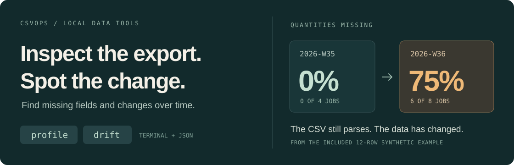

# csvops



**CSV profiling and comparisons over time, in your terminal.**

[Quick start](#quick-start) · [Worked example](#see-a-change) · [Recipes](#put-it-to-work) · [Reference](docs/reference.md) · [Contributing](#development)

A job export lands in your inbox. A supplier sends a new price file. An unfamiliar dataset needs to go into another system. Before putting it to work, you want to know what is actually in it.

`csvops` gives you that first look: missing fields, mixed types, frequent values, numeric summaries, and changes across time periods. It runs locally as a single Rust executable, with readable terminal output and JSON for scripts.

| Command | What it answers |
| --- | --- |
| `profile` | What is in this file? Which fields need a closer look? |
| `drift` | How do row counts, missing fields, and numeric means change over time? |

## Quick start

Install from source with **Git and [Rust](https://www.rust-lang.org/tools/install) 1.94+**:

```sh
git clone https://github.com/rondiver/csvops.git
cd csvops
cargo install --path . --locked

csvops profile examples/jobs.csv
```

Then compare the two weeks in the same file:

```sh
csvops drift examples/jobs.csv --time-col created_at --grain week
```

The included data is synthetic and the results are checked by the CLI tests. Once built, csvops runs offline. To try it without installing a command, use `cargo run --locked -- profile examples/jobs.csv` from the checkout.

## See a change

A file can parse successfully while important fields go missing. The example models a job export across two weeks:

| Measure | Week 35 | Week 36 |
| --- | ---: | ---: |
| Jobs | 4 | 8 |
| Missing quantities | 0 of 4 | 6 of 8 |
| Missing-quantity rate | 0% | **75%** |
| Mean quoted total | 100 | 200 |

`profile` shows that six of the twelve quantities are missing. `drift` shows **when that changed**, alongside the increase in volume and average quoted total.

The quantities deserve investigation. The larger quotes might simply reflect a different mix of jobs. The report gives you specific changes to follow up on; interpreting them still needs the business context.

**Inspect the evidence:** [12-row CSV](examples/jobs.csv) · [Terminal report](examples/drift.txt) · [Profile JSON](examples/profile.json) · [Drift JSON](examples/drift.json)

## Put it to work

### Get acquainted with an export

```sh
csvops profile examples/jobs.csv
```

See the file's structure and accepted row count, then inspect each column's type, missing values, distinct counts, numeric summaries, and common values. Warnings draw attention to likely identifiers, constant columns, mixed types, and unusual numeric values.

### Compare a timestamped file by period

```sh
csvops drift examples/jobs.csv --time-col created_at --grain week
```

Choose `day`, `week`, or `month`. csvops compares consecutive populated periods and reports changes in volume, missing-value rates, and numeric means. Offset-bearing timestamps are normalized to UTC.

### Take the results into a script

```sh
csvops profile examples/jobs.csv --json > profile.json
```

JSON contains file metadata, column measurements, and warnings with machine-readable codes. With [jq](https://jqlang.org/) installed, extract just the columns with missing values:

```sh
csvops profile examples/jobs.csv --json |
  jq '.columns[] | select(.missing_count > 0) | {name, missing_count, missing_percentage}'
```

```json
{
  "name": "quantity",
  "missing_count": 6,
  "missing_percentage": 50
}
```

[All options and supported formats →](docs/reference.md)

## How the reports are built

**Profiles accumulate measurements while reading rows.** Means and variances use streaming calculations. Distinct counts are exact through 10,000 unique values, then estimated with HyperLogLog. Percentiles use a bounded reservoir sample; frequent values use a bounded sketch. Approximation and sampling details are documented in the [reference](docs/reference.md#input-errors-and-limits).

**Drift keeps a summary for each populated time bucket.** It flags row-count changes above 50%, missing-rate changes above 10 percentage points, and numeric-mean changes above 20%. A change from zero to a nonzero mean is also flagged. These thresholds highlight changes worth investigating.

**Omissions stay visible.** Rows with inconsistent field counts and invalid timestamps are counted explicitly. Encoding errors and numeric overflow stop the analysis with an error. Repeated runs with the same input order, options, and version use deterministic sampling and ordering.

## Reading a report

- Statistics cover accepted rows; drift also requires a valid timestamp. Check the reported skipped counts.
- A successful exit means the analysis completed. Reports can still contain warnings. [Exit codes and error behavior](docs/reference.md#input-errors-and-limits).
- Type labels, identifiers, and outliers are heuristics. Numeric calculations use floating point; sampled outlier counts describe the sample. [Measurement limits](docs/reference.md#input-errors-and-limits).

Memory depends on the width of the file, field lengths, sample size, and number of time buckets. See the [reference](docs/reference.md#input-errors-and-limits) for the measurement and resource limits.

## Development

```sh
cargo fmt --all -- --check
cargo clippy --locked --all-targets -- -D warnings
cargo test --locked
```

Unit and CLI regression tests cover the algorithms and the complete command path, including malformed rows, Unicode, date parsing, time zones, repeatability, numeric failures, and closed output pipes. CI is configured for Linux, macOS, and Windows.

For a bug report, include the command, tool version, a small synthetic CSV that reproduces the problem, and the expected result. A useful contribution starts with a concrete input and an independently checkable answer.

[Source map and release checks](docs/maintaining.md) · [Current gaps and issue review](docs/issue-review.md) · [Changelog](CHANGELOG.md)

---

Built by [Ron Diver](https://rondiver.com/), owner of Puget Bindery and a builder of tools for operational work. Available under the [MIT license](LICENSE).
